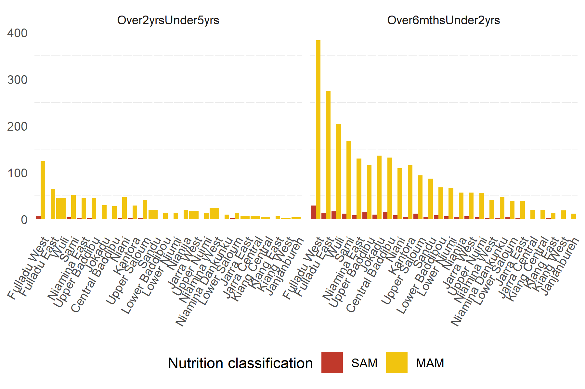
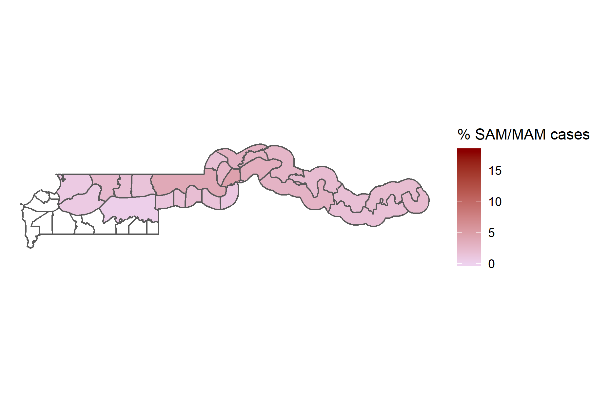

```{r setup, include=FALSE}
knitr::opts_chunk$set(echo = FALSE)
setwd("C:/Users/william.olander/Desktop/201807_GMB_NutScreening/4_OutputTables")
```

## R Markdown

This is an R Markdown presentation. Markdown is a simple formatting syntax for authoring HTML, PDF, and MS Word documents. For more details on using R Markdown see <http://rmarkdown.rstudio.com>.

When you click the **Knit** button a document will be generated that includes both content as well as the output of any embedded R code chunks within the document.

## Slide with Bullets

- Bullet 1
- Bullet 2
- Bullet 3

---
## Methodology
In _____, 67,329 children were screened in 25 Districts.  
.center[]
---
## Number of SAM and MAM cases by District
.center[]

---
## Number of SAM and MAM cases by District: Under 2s
.center[]
---
## Number of SAM and MAM cases by District: Over 2s
.center[]
---
## Proportion of SAM and MAM cases by District
.center[]
---
## Proportion of SAM and MAM cases by District: Under 2s
.center[]
---
## Proportion of SAM and MAM cases by District: Over 2s
.center[]
---
## Number of children who recived vitamin A by District
.center[]
---
## Number of children who recived vitamin A by District: Under 2s
.center[]
---
## Number of children who recived vitamin A by District: Over 2s
.center[]
---
## Proportion of children who recieved vitamin A by District
.center[]
---
## Proportion of children who recieved vitamin A by District: Under 2s
.center[]
---
## Proportion of children who recieved vitamin A by District: Over 2s
.center[]

---
## Number of children who recived de-worming medication by District
.center[]
---
## Number of children who recived de-worming medication by District: Under 2s 
.center[]
---
## Number of children who recived de-worming medication by District: Over 2s
.center[]
---
## Proportion of children who recieved de-worming medication by District
.center[]
---
## Proportion of children who recieved de-worming medication by District: Under 2s 
.center[]
---
## Proportion of children who recieved de-worming medication by District: Over 2s
.center[]

---
## Number of children who had diarrhoea by District
.center[]
---
## Number of children who had diarrhoea by District: Under 2s 
.center[]
---
## Number of children who had diarrhoea by District: Over 2s
.center[]
---
## Proportion of children who had diarrhoea by District
.center[]
---
## Proportion of children who had diarrhoea by District: Under 2s 
.center[]
---
## Proportion of children who had diarrhoea by District: Over 2s
.center[]
---
## Number of children with malaria by District
.center[]
---
## Number of children with malaria by District: Under 2s 
.center[]
---
## Number of children with malaria by District: Over 2s
.center[]
---
## Proportion of children with malaria by District
.center[]
---
## Proportion of children with malaria by District: Under 2s 
.center[]
---
## Proportion of children with malaria by District: Over 2s
.center[]